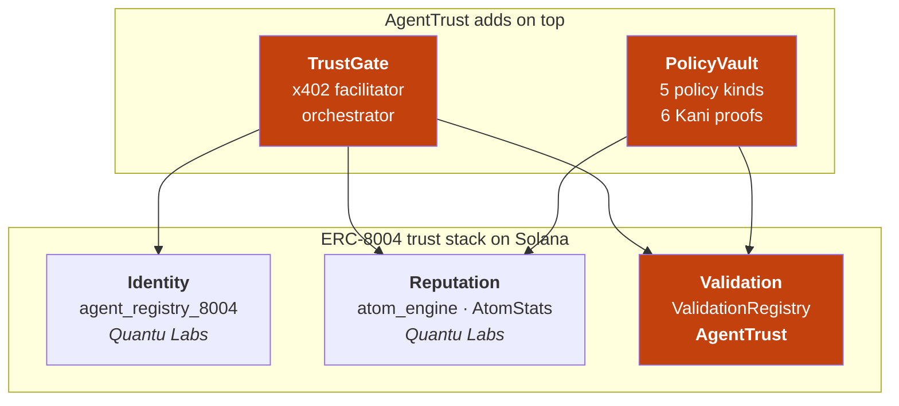
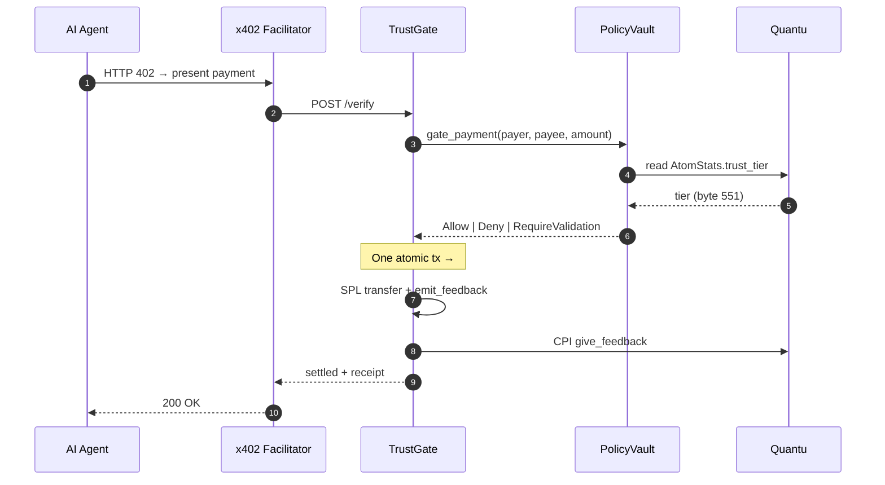

# AgentTrust

> The trust layer for AI-agent payments on Solana. A policy + reputation check that runs right before an agent's payment settles, completing the third leg of the ERC-8004 trust stack. **Six formally-verified safety properties.** Day-one Pay.sh integration (Solana Foundation's first x402 facilitator, launched May 5 2026 with Google Cloud).

[](https://www.agenttrust.tech)
[](https://docs.agenttrust.tech)
[](https://mcp.agenttrust.tech)
[](https://www.npmjs.com/package/@agenttrust-sdk/trustgate)
[](https://www.npmjs.com/package/@agenttrust-sdk/mcp)
[](.github/workflows/kani-prove.yml)
[](.github/workflows/)
[](./LICENSE)

Submitted to the **Solana Frontier 2026** hackathon by [@mohit-1710](https://github.com/mohit-1710).

**Read first:** [`docs/COMPLETING-THE-TRUST-STACK.md`](./docs/COMPLETING-THE-TRUST-STACK.md) — the full v1 narrative (~2k words, Foundation-aligned).

---

## Try it in 60 seconds

```bash
# Add the MCP to Claude Code / Claude Desktop / Cursor
npx -y @agenttrust-sdk/mcp@latest

# Or use the hosted MCP (no install)
# → https://mcp.agenttrust.tech

# Or hit the live demo (real devnet, no setup)
curl -i https://demo.agenttrust.tech/protected
```

Full walkthrough at [docs.agenttrust.tech/quickstart](https://docs.agenttrust.tech/quickstart).

### Live surfaces

**Try it:**

| Surface | URL |
| --- | --- |
| Demo (live `/protected` → `/settle` round-trip) | https://demo.agenttrust.tech |
| Hosted MCP (HTTP + stdio) | https://mcp.agenttrust.tech |
| Facilitator API (`/verify` + `/settle` + `/receipt`) | https://api.agenttrust.tech |
| SDK | `npm i @agenttrust-sdk/trustgate` |
| MCP package | `npx -y @agenttrust-sdk/mcp` |

**Inspect:**

| Surface | URL |
| --- | --- |
| Marketing site | https://agenttrust.tech |
| Docs | https://docs.agenttrust.tech |
| Status page | https://status.agenttrust.tech |
| Code | https://github.com/agenttrust-labs/agenttrust |

> All endpoints run on Solana devnet. The bare `agenttrust-*.fly.dev` hostnames also resolve, but the `agenttrust.tech` URLs above are canonical.

**Two MCP surfaces by design.** Local install (`npx -y @agenttrust-sdk/mcp@latest`) ships the full 21-tool surface and signs with your own keypair. Hosted (`mcp.agenttrust.tech`) is read-only by design — 13 tools, no shared signer. A shared signer would mean every user's on-chain identity is owned by the operator; that's a security model, not a UX shortcut. Write tools live in the local install. See [/quickstart](https://docs.agenttrust.tech/quickstart#two-mcp-surfaces) for the comparison table.

---

## What AgentTrust is

A check that runs right before an AI agent's payment lands. It reads the counterparty's on-chain reputation, evaluates a programmable spending policy, and decides whether the payment should go through. If yes, it settles atomically and writes feedback back to the reputation registry. If no, it returns a typed Deny envelope an agent can act on.

Quantu Labs shipped two of the three ERC-8004 legs on Solana: `agent-registry-8004` (Identity + Reputation). AgentTrust productizes the third leg (Validation) and introduces the policy + facilitator surfaces an AI-agent payment system actually needs. Built on top of Foundation-aligned primitives, not parallel to them.

---

## The trust stack



TrustGate is the orchestrator — a user calls AgentTrust and never has to learn Quantu's surface directly. Cross-program CPIs happen inside TrustGate.

---

## At payment time



The gate is fail-fast across five policy kinds. The settle is one atomic Solana transaction (splitting it opens a real footgun on Token-2022 mints with `TransferHook`).

---

## The three components

### 1 · PolicyVault — programmable spending policies

Five orthogonal policy kinds composed under one `gate_payment` instruction with fail-fast semantics:

| # | Policy kind | What it does |
|---|-------------|--------------|
| 1 | `KillSwitch` | Multisig-controlled emergency pause (1..=7 members) |
| 2 | `Spending` | Per-tx + daily (UTC midnight) + weekly (ISO Monday) limits |
| 3 | `Velocity` | Sliding-window cumulative spend, tier-decay (¼, ½, ¾, 1×, 5⁄4×) |
| 4 | `CounterpartyTier` | Reads Quantu `AtomStats.trust_tier` (byte 551) — the wedge |
| 5 | `RequireValidation` | Gates against `ValidationAttestation` PDA (capability proof) |

Manual byte-offset deserialization of Quantu PDAs (Pattern B per playbook §02-A): **zero Cargo dep on Quantu's crate**. Schema-version canary at byte 560 catches breaking changes early.

**Six Kani-proven invariants** (machine-checked via [model-checking/kani](https://github.com/model-checking/kani)):

| # | Invariant | Sub-checks | Time |
|---|-----------|-----------:|-----:|
| 1 | `paused_implies_no_allow` — KillSwitch paused ⇒ never Allow | 126 | 0.20s |
| 2 | `velocity_counter_le_limit` — Allow preserves cumulative ≤ max | 9 | 0.03s |
| 3 | `counterparty_tier_monotone` — strict pass ⇒ loose pass | 8 | 0.02s |
| 4 | `validation_expiry_correct` — expired attestation ⇒ never Allow | 85 | 0.21s |
| 5 | `multisig_threshold_enforced` — distinct signer count ≥ threshold | 149 | 62.55s |
| 6 | `gate_payment_strict_correctness` — strict Ok ⇔ Allow + 3 disjoint variants | 258 | 0.9s |

**Total: 635 sub-checks, 6/6 proven, ~64s.** CI ([`kani-prove.yml`](.github/workflows/kani-prove.yml)) runs all six on every PR.

**Devnet:** [`8Y6fGeNEHgmWmbt8JsRcF72jxbeBfJhomMjG6SuoJQTR`](https://explorer.solana.com/address/8Y6fGeNEHgmWmbt8JsRcF72jxbeBfJhomMjG6SuoJQTR?cluster=devnet)

### 2 · TrustGate — x402 facilitator + orchestrator

Anchor program plus a TypeScript SDK on npm. Owns the cross-program CPIs (Quantu `register_agent`, `give_feedback`, `dispute_payment`) so callers stay inside AgentTrust's surface. Drop-in middleware for any x402 facilitator's Express app:

```ts
import express from "express";
import { Keypair } from "@solana/web3.js";
import { mountTrustGate } from "@agenttrust-sdk/trustgate/express";

const app = express();
app.use(express.json());

await mountTrustGate(app, {
  rpcUrl:             "https://api.devnet.solana.com",
  facilitatorKeypair: Keypair.fromSecretKey(/* … */),
  network:            "solana-devnet",
  atomicityEnforced:  true, // literal `true` — TS compile error on `false`
});

app.listen(3000);
```

You now have `POST /verify`, `POST /settle`, `POST /dispute`, and `GET /receipt/:hash`. x402-spec headers automatic.

**Atomic-tx invariant:** `gate_payment + transfer + emit_feedback` must execute as ONE Solana transaction. The SDK enforces atomicity at two layers (compile-time literal-type guard `{ atomicityEnforced: true }` + runtime `assertAtomicityEnforced` throw). Skipping either layer re-opens the corruption vector.

**Devnet:** [`HF8zHfoyA7b5mhLViopTnRMprc6ZT5KActHTdkFrih2N`](https://explorer.solana.com/address/HF8zHfoyA7b5mhLViopTnRMprc6ZT5KActHTdkFrih2N?cluster=devnet) · **npm:** [`@agenttrust-sdk/trustgate`](https://www.npmjs.com/package/@agenttrust-sdk/trustgate)

### 3 · ValidationRegistry — capability attestation

The third ERC-8004 leg Quantu archived in v0.5.0 pending redesign, productized. Permissionless namespace + attestor self-registration. Downstream-consumer-filtering is the v1 model (PolicyVault stores `accepted_attestors[]` per-policy). Audit-trail-preserving revocation per ERC-8004 spec.

| Surface | Detail |
|---------|--------|
| PDAs | `CapabilityNamespace`, `AttestorProfile`, `ValidationRequest`, `ValidationAttestation` |
| Instructions | `register_namespace`, `register_attestor`, `request_validation`, `respond_to_validation`, `revoke_validation` |
| v1 capability namespaces | KYC tier-1/2/3 · audit (Halborn, OtterSec) · model-card (Anthropic, OpenAI) · jurisdiction · compliance.payments · agent-source |
| Ed25519 sysvar verify | v1.1+ deliverable (v1 attestor signs via tx signature; non-repudiation against future key compromise needs sysvar pattern) |

**Devnet:** [`Cx4RFa6ysw3qXYhugPkF8pFSWBkmKq59h2dWgF2tKhtv`](https://explorer.solana.com/address/Cx4RFa6ysw3qXYhugPkF8pFSWBkmKq59h2dWgF2tKhtv?cluster=devnet)

---

## Single-tool bootstrap (0.4.0)

A brand-new wallet with only `~/.config/solana/id.json` goes from zero to "I can simulate payments and emit feedback" in **one tool call**. No precondition steps, no spoon-feeding.

```ts
// Via the MCP (Claude Code / Desktop / Cursor):
await agenttrust_init_policy({
  policy_id: 1,
  enabled_kinds_bitmask: 0b00011,         // KillSwitch + Spending
  spending: { per_tx_max: 1_000_000n },   // 1 USDC
});

// → PolicyAuthority + KillSwitchState + TrustGateAuthority + Quantu agent_account
//   + Policy, all initialized in one atomic devnet tx.
// → selfHealed: true, healedSteps: ["register_agent_via_cpi", "init_authority", "init_killswitch"]
```

The 21-tool MCP surface and the SDK both ride the same atomic-bootstrap. Receipts (tx signatures + PDA addresses) come back in the tool envelope. Re-running is idempotent — the self-heal checks `fetchNullable` upstream of every prepend.

---

## Live devnet trace

Three complete end-to-end flows captured on devnet. Click any signature.

| Flow | Headline tx | What it proves |
|---|---|---|
| **Single-tool bootstrap** (0.4.0) | [`2zxucf9DjPYrqSMBhzL9SXmw6ZEBx8ut8KdjuCp6SEwwCmmEUbgFUCvF89ZLWUi73aqsBi2nTpouDM9YBcQbp8La`](https://explorer.solana.com/tx/2zxucf9DjPYrqSMBhzL9SXmw6ZEBx8ut8KdjuCp6SEwwCmmEUbgFUCvF89ZLWUi73aqsBi2nTpouDM9YBcQbp8La?cluster=devnet) | 6 PDAs initialized in one atomic tx |
| **Pay.sh + AgentTrust atomic settlement** | [`jMobmWJUAXuL8FmQujfxW9NmeMbzADUoABzqjiMeuc5m3YXyeuZeUw1ZJc29JGsqyWQGDY8q3vrtBdamhKXraag`](https://explorer.solana.com/tx/jMobmWJUAXuL8FmQujfxW9NmeMbzADUoABzqjiMeuc5m3YXyeuZeUw1ZJc29JGsqyWQGDY8q3vrtBdamhKXraag?cluster=devnet) | `emit_feedback` PDA-signed CPI → `give_feedback` → `update_stats` |
| **ValidationRegistry full lifecycle** | [`5B3PfDGYhzhusJwjXURnhpkZ2umipdegfNREtJbcgZySR7nr976CcSJXqYSzB8eSYT14W3yrzGuks75S7pdZD3WK`](https://explorer.solana.com/tx/5B3PfDGYhzhusJwjXURnhpkZ2umipdegfNREtJbcgZySR7nr976CcSJXqYSzB8eSYT14W3yrzGuks75S7pdZD3WK?cluster=devnet) | All 5 instructions exercised end-to-end |

**Verifiable artifacts** (click to inspect):

- `FeedbackEmissionLog` PDA → [`HB4BBi9jaD3VPcZkQQaH3DxukSqBiXfW8RejtaLa8bF3`](https://explorer.solana.com/address/HB4BBi9jaD3VPcZkQQaH3DxukSqBiXfW8RejtaLa8bF3?cluster=devnet) (owned by trustgate, score=100)
- Tier-3 `agent_account` → [`5PfaofvEUf3adtJwMho7zzbfvgxwxbvp2V5moqhtLK8y`](https://explorer.solana.com/address/5PfaofvEUf3adtJwMho7zzbfvgxwxbvp2V5moqhtLK8y?cluster=devnet)
- `ValidationAttestation` PDA → [`C6Yr7oKcZ6sDVibR35SWbFnGCXyfQjLeRCiPbjxYq6vY`](https://explorer.solana.com/address/C6Yr7oKcZ6sDVibR35SWbFnGCXyfQjLeRCiPbjxYq6vY?cluster=devnet)

Reproduce locally with the bundled smoke scripts:

```bash
# Single-tool bootstrap (0.4.0) — one call, no pre-warm
npx -y @agenttrust-sdk/mcp@latest    # then call agenttrust_init_policy

# Pay.sh atomic settlement (~0.03 SOL)
pnpm --filter ./examples/pay-sh-demo exec ts-node scripts/devnet-smoke.ts

# Validation lifecycle (~0.012 SOL)
pnpm --filter ./examples/attestor-demo run smoke
```

Full traces land in `submission/e2e-claude-code-0.4.0-2026-05-13/` (gate run + side-by-sides against 0.3.5).

---

## Verification — don't trust this README

Every claim on this page is independently checkable. From your terminal:

```bash
# 1. Verify all 3 programs are executable on devnet
for p in 8Y6fGeNEHgmWmbt8JsRcF72jxbeBfJhomMjG6SuoJQTR \
         HF8zHfoyA7b5mhLViopTnRMprc6ZT5KActHTdkFrih2N \
         Cx4RFa6ysw3qXYhugPkF8pFSWBkmKq59h2dWgF2tKhtv; do
  solana program show "$p" --url devnet | grep Executable
done

# 2. Install + inspect the SDK and MCP
pnpm add @agenttrust-sdk/trustgate @agenttrust-sdk/mcp
cat node_modules/@agenttrust-sdk/trustgate/package.json | jq '{ name, version, exports }'

# 3. Hit the hosted MCP for a live tool count + version
curl -sf https://mcp.agenttrust.tech/ | jq '{ version, toolCount, network }'

# 4. Clone and run the Kani proofs
git clone https://github.com/agenttrust-labs/agenttrust && cd agenttrust
cargo install --locked kani-verifier
cargo kani --manifest-path programs/policy-vault/Cargo.toml \
  --harness paused_killswitch_implies_no_allow

# 5. Run the Anchor TS test suite
anchor test --skip-deploy --provider.cluster devnet
```

---

## Repo layout

```
agenttrust/
├── programs/
│   ├── policy-vault/           # 5 policy kinds + 6 Kani proofs
│   ├── trustgate/              # x402 facilitator + orchestrator CPIs
│   └── validation-registry/    # capability attestation
├── trustgate/
│   ├── server/                 # FacilitatorAdapter dispatch (4 adapters)
│   └── sdk/                    # @agenttrust-sdk/trustgate npm package
├── mcp/                        # @agenttrust-sdk/mcp — 21 tools for Claude Code/Desktop/Cursor
├── examples/
│   ├── pay-sh-demo/            # hosted at demo.agenttrust.tech
│   └── attestor-demo/          # ValidationRegistry lifecycle smoke
├── web/                        # agenttrust.tech (Vercel)
├── docs-site/                  # docs.agenttrust.tech (Fumadocs, Vercel)
├── status-page/                # status.agenttrust.tech (Vercel)
├── tests/                      # Anchor TS integration tests + adversarial harness
└── .github/workflows/          # 16 CI workflows: anchor-test · kani-prove · ts-test
                                #   · adapter-contract-conformance · mcp-protocol-conformance
                                #   · bundle-size · daily-devnet-smoke · devnet-integration
                                #   · idl-diff · kani-budget · link-check · lint-and-format
                                #   · lockfile-freshness · secret-scan · hosted-surface-check · build
```

---

## Test coverage

| Layer | Where |
|---|---|
| Rust unit tests | `cargo test --workspace --lib` |
| Kani formal proofs (6 invariants · 635 sub-checks) | `cargo kani` per `proofs/*` |
| Anchor TS end-to-end | `anchor test --provider.cluster devnet` |
| Adversarial harness | `tests/adversarial.spec.ts` |
| SDK unit tests | `cd trustgate/sdk && pnpm test` |
| Server adapter tests | `cd trustgate/server && pnpm test` |
| MCP unit tests + protocol conformance | `cd mcp && pnpm test` |
| pay-sh-demo flow | `cd examples/pay-sh-demo && pnpm test` |
| attestor-demo lifecycle | `cd examples/attestor-demo && pnpm test` |

300+ tests + 6 formal proofs + 14 adversarial scenarios. All green on `main` (see [Actions](https://github.com/agenttrust-labs/agenttrust/actions)).

---

## What's deferred to v1.1+

- **Ed25519 sysvar verify in `respond_to_validation`** — v1 attestor signs the tx (sufficient for hackathon demo). v1.1 mirrors Quantu's `set_agent_wallet` pattern for non-repudiation against future key compromise.
- **Stake-weighted attestor scoring + slashing** — v1 ships permissionless attestor + downstream-consumer-filtering. v1.1 adds `staked_amount` on `AttestorProfile`. v2 adds slashing arbitration.
- **AgentAccount.owner cross-program check on `init_authority`** — v1 has a documented bootstrap-race (anyone can init_authority for any agent first). v1.1+ closes via reading byte 72 of Quantu's `AgentAccount`.
- **Cross-chain attestation portability** — same `capability_hash` working across Base / Polygon / Arbitrum ERC-8004 implementations. Phase-3 deliverable (Day 60+).

These are explicit, scoped, tracked. None block the v1 demo or the Foundation-alignment narrative.

---

## Acknowledgments

- **Solana Foundation + Google Cloud** — Pay.sh, the first x402 facilitator on Solana, [launched 2026-05-05](https://solana.com/news/solana-foundation-launches-pay-sh-in-collaboration-with-google-cloud). AgentTrust ships day-one Pay.sh integration as the canonical adapter.
- **Quantu Labs** — `8004-solana` (IdentityRegistry + ReputationRegistry + atom-engine), MIT license. AgentTrust reads their PDAs via byte-precise parsers; pinned commit `bfb09ad`.
- **Solana Foundation** — ERC-8004 endorsement, x402 spec, Anchor framework.
- **Model Checking @ AWS / Kani team** — formal verification toolchain that made the 6 invariants tractable in 13 days.

---

## License

MIT for everything in `programs/`, `trustgate/sdk/`, `trustgate/server/`, `tests/`, `scripts/`, `mcp/`, and `web/`. CC-BY-4.0 for documentation under `docs/` (kept local). See [LICENSE](./LICENSE).

---

## Contact

Questions or feedback: email [mohit@agenttrust.tech](mailto:mohit@agenttrust.tech) or [open an issue](https://github.com/agenttrust-labs/agenttrust/issues).
